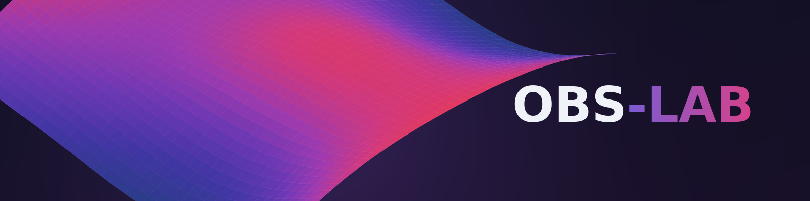

# OBS-LAB

**On-premise data and document intelligence.**

Analysis, charts and semantic search, deployed on your own infrastructure. Your data stays yours.

---

## What OBS-LAB does

OBS-LAB processes, analyses and searches a private collection of data, documents, spreadsheets and images. Every model runs on your own hardware, and nothing leaves your servers unless you deliberately enable a cloud language model.

- **Data** worksheets with 32 chart types, curve fitting, statistical tests, forecasting and Monte Carlo simulation
- **Documents** semantic search in any language, with answers checked citation by citation
- **Code** run Python, R, Octave, JavaScript, Java, C and C++ in disposable sandboxed containers
- **Images** visual and text search, colour sampling and a chart digitiser that recovers numbers from a chart image
- **Multi-user** role-based access control, each user sees only their own material

## Privacy by design

Your archive never leaves your infrastructure. Search, statistics, clustering and image analysis run locally and never depend on an external service. For the language model you choose one of three modes:

| Mode | Outbound traffic |
| --- | --- |
| Local, fully offline | None |
| No model at all | None |
| Cloud API | Opt-in only |

The cloud mode is the single route by which any data can leave your infrastructure, and it is off unless you turn it on.

## Tech stack

- **Backend** Python and FastAPI
- **Retrieval** FAISS HNSW with cross-encoder reranking
- **Embeddings** BAAI/bge-m3
- **Desktop shell** Tauri

## Deployment

OBS-LAB is a B2B product installed on site, directly on your own servers. Because it runs from the source, it is not tied to a single operating system and can be fitted to the environment your organisation already runs.

## Contact

- **Email** obslab2026@gmail.com
- **LinkedIn** [OBS-LAB](https://www.linkedin.com/company/obs-lab)
- **Web** [obs-lab.tech](https://www.obs-lab.tech/)
